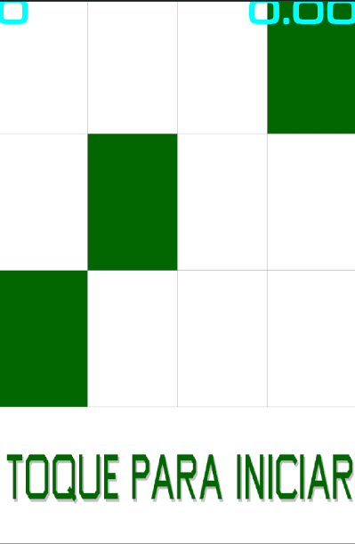

# my-piano-tiles
Jogo desenvolvido no Curso de Libgdx da Udemy para dispositivos Android.

## Como jogar
* Toque nas notas corretas (indicadas pela cor verde) da fileira inferior.
* Quando errar a nota, ela ficará marcada em vermelho e o jogo encerra.
* Toque na tela novamente para reiniciar o jogo.

